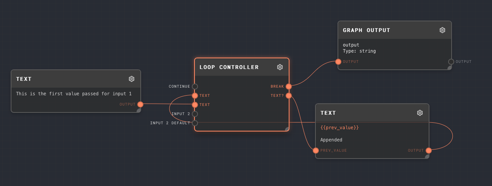
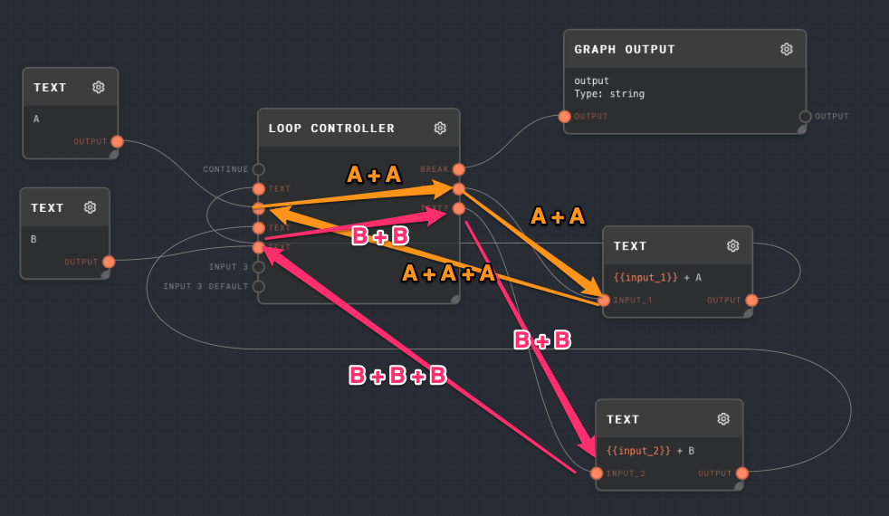
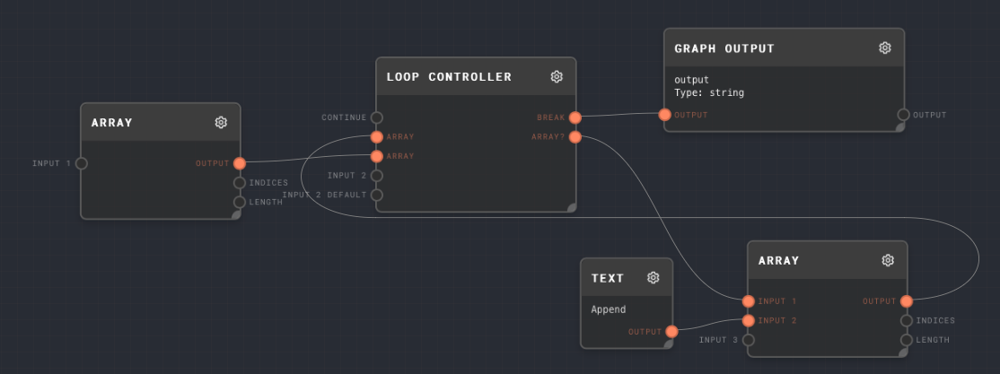
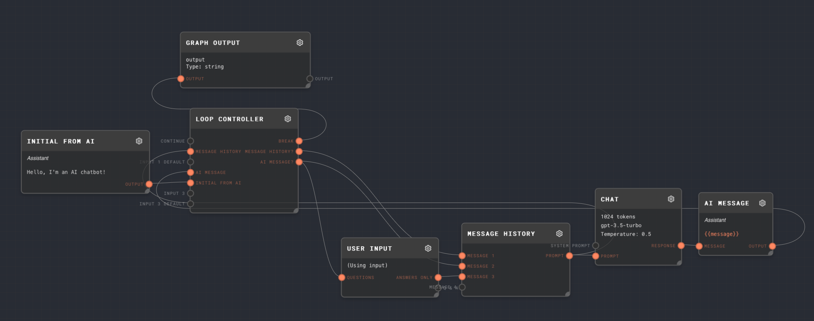

# Loops

Loops and the loop controller are the most difficult concept in Lawme. They are also incredibly powerful and necessary for many use cases.

The following is the simplest loop you can create in Lawme:

:::info

The block connected to Break is required at the moment. This gives the flow a "start point" to work backwards from. For basic cases, just connect a Output block to `Break`.

:::

## Loop Controller

The loop controller is the only block in Lawme that is allowed to contain cycles of blocks including itself. The idea is the values flow _through_ the loop controller in a cycle. **All** values that can change in a loop **must** flow through the loop controller itself.

### Inputs

The loop controller has one input `Continue` that will always be present. This is a `boolean` type (but the value passed into it will be coerced into a boolean).

If the value passed into `Continue` is truthy (or `control-flow-excluded`! See [Control Flow](./control-flow.md)), then the loop will continue executing. If the value is falsy, then the loop will stop executing.

Next, the loop controller has a dynamic number of _pairs_ of values. Each pair consists of an **input** and a **default input**.

The **default input** (the 2nd in each pair!) is optional. This is the default value passed through the loop controller. In most cases, you will pass values from _outside the loop controller_ into the default inputs of the loop controller. These function as the "initial state" of your loops.

Therefore, values for the **input** ports (the 1st in each pair!) should come from _inside_ the loop (blocks that are connected to the loop controller's output ports).

### Outputs

For each pair of inputs to the loop controller (excluding the `Continue` port), the loop controller will have one additional output port.

On the first iteration, the value of this port will be the value passed into the **default value** port of the loop controller. On subsequent iterations, the value of this port will be the value passed into the **input** port of the loop controller on the previous iteration.

### Example

The following image shows a loop controller with two values flowing through it. The initial values are `A` and `B`:

The default values of `A` and `B` flow through the loop controller to the first and 2nd outputs on the loop controller. These values flow into two text blocks, one that appends `+ A`, and one that appends `+ B`. These then flow back into the corresponding input ports of the loop controller.

On the 2nd iteration, the default values can be ignored, and the flow looks like this:

The `A + A` and `B + B` values flow to the output ports of the loop controller, and back into the text blocks to append `+ A` and `+ B` again, flowing back into the loop controller again.

:::info

This loop will never break. If you were to run this flow, it would error once the loop controller reached its max iteration count.

:::

## Recipes

### Appending to a list

A common use-case is to keep appending to some sort of array during a loop. As the [Array Block](../block-reference/array.mdx) is set to Flatten by default, this is easily accomplished by using an array block to concatenate the "current" value of the array with any additional values.

### Chatbot

Let's say you want to make a ChatGPT style chatbot in Lawme. A flow of that would look something like this:

The loop maintains two pieces of state.

1. The entire chat history minus the last chatbot message
2. The last message from the chatbot

The flow is roughly as follows:

1. The initial message from the AI is passed into the default value of the 2nd input pair. This "seeds" the flow with the initial question to present to the user.
2. This value (the 2nd output port after `Break`) is passed into a [User Input Block](../block-reference/user-input.mdx). This prompts the user with the last message that the chatbot sent.
3. A full message history is constructed, consisting of:
   1. The previous full message history
   2. The last message from the chatbot
   3. The response from the user
4. This full message history is passed into a [Chat Block](../block-reference/chat.mdx). This block will return the next message from the chatbot.
   1. At the same time, the constructed full message history is looped back into the loop controller to form the "full message history" for the next loop.
5. The Chat Block passes its response text into a [Prompt Block](../block-reference/prompt.mdx). The prompt block is tagged with "Assistant" as the user, so that the chatbot can differentiate who sent each message.
6. This chat-message response from the AI is passed into the value of the 2nd pair of the loop controller block.
7. The loop continues

It can sometimes be difficult to understand the flow of a loop, and how to wire it up. The best way to understand it is to play around with it and see what happens!
