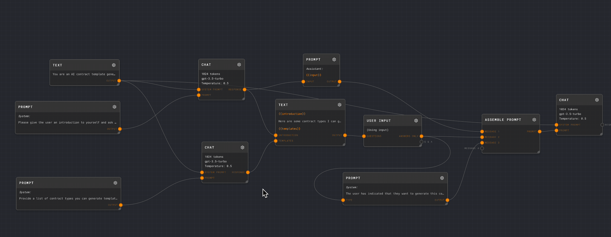

## Adding Blocks

To add a block to the current flow, right click in the empty space on the flow (or press space!), and enter the Add menu.

You can search for a block by starting to type after the menu is open.

Blocks are grouped by their category. Selecting a block will add it to the flow where you right clicked.

See the [Block Reference](../../block-reference) for more information about all possible blocks that can be added.

## Moving Blocks

Click and drag on the title bar of a block to move it on the block canvas. You can also select multiple blocks by holding shift and clicking on the title bars of multiple blocks. You can then move all of the selected blocks as a group.

## Deleting Blocks

Right click on a block and select **Delete** to delete it. **Warning: There is no undo at this time!**

## Connecting Blocks

Blocks are connected by clicking and dragging from a port on one block to a port on another block. Ports are the connection points on the block. Ports can be inputs or outputs. Inputs are on the left side of the block and outputs are on the right side of the block.

The output port of a block can connect to multiple input ports on other blocks.

The input port of a block can only connect to one output port on another block.

The data type of every port is available in the documentation for each block in the [Block Reference](../../block-reference).

## Disconnecting Blocks

Click and drag on a connected port to move the connection to a different port, or click and drag to an empty space for an existing connection to delete the connection.

## Creating a Subflow

To create a subflow, select multiple blocks by holding shift and clicking on the title bars of multiple blocks. Then right click on one of the selected blocks and select **Create Subflow**. This will create a new (_unsaved!_) flow containing the blocks you selected, as well as additional input and output blocks to connect the subflow to the parent flow.

Make sure you go into the flow info section for the subflow and give it a name and description, or else it will be Untitled Flow.

Make sure you save your new flow! (CMD+S or CTRL+S)

The source blocks will **not** be removed from the parent flow at this time. It is up to you to replace them with your newly created subflow.

## Editing a Block

Click the gear icon on the top right of a block to edit it. This will open the Block Editor. See the [interface overview](./overview-of-interface) for more information about the Block Editor.
